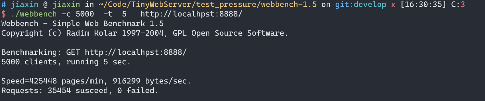

# TinyWebServer

#### 介绍

[TinyWebserver CMake版](https://github.com/x-jiaxin/TinyWebServer)

[原项目地址](https://github.com/qinguoyi/TinyWebServer)

#### 软件架构

软件架构说明

#### 安装教程

1. chmod +x setup.sh
2. ./setup.sh

#### 使用说明

1. cd build/bin
2. ./TinyWebServer
3. 浏览器输入[localhost:8888](localhost:8888)

#### 压力测试

使用webbench，测试5000并发

